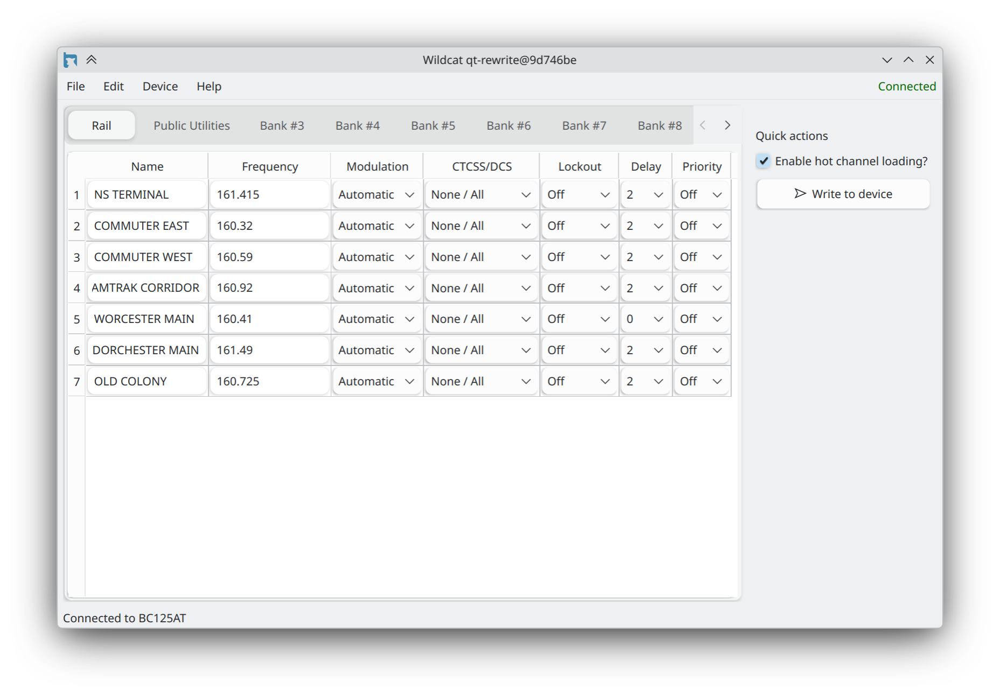

  <ul align="center" style="list-style: none;">
    

      <h1>Wildcat</h1>
    

  </ul>

Open-source Uniden BC125AT programmer for Windows, Linux, and FreeBSD.
 

  

 

### Features
* Cross-platform
* Native Qt UI
* Fast loading of channels from the device
* Adjust squelch & volume
* Share configuration with others using the export tool
* Load preset frequencies from the shared database
* Give banks custom nicknames
* *and more!*

 

## Migration from Wildcat v1

Migrating from the old version of Wildcat is easy, you can either save your frequencies to your scanner and load them in the new version, or save them to a `wcat` file and convert it to a `csv` using the builtin `wcat2csv` tool.
